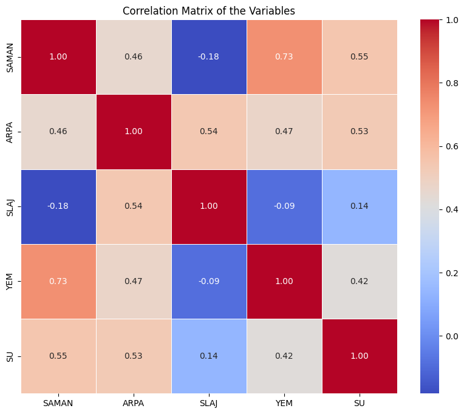
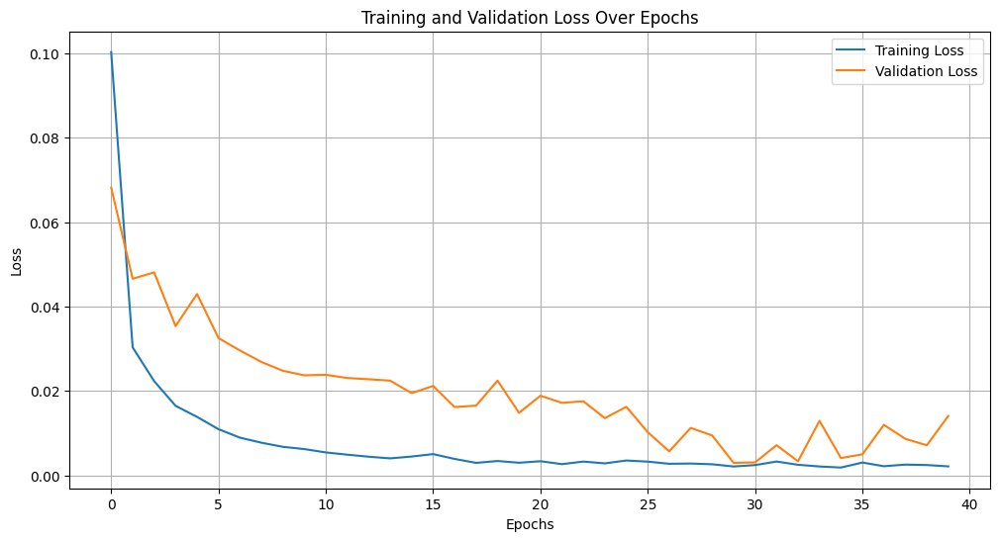
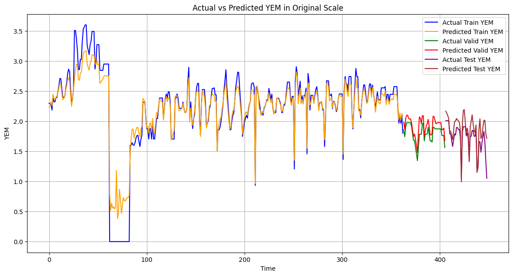
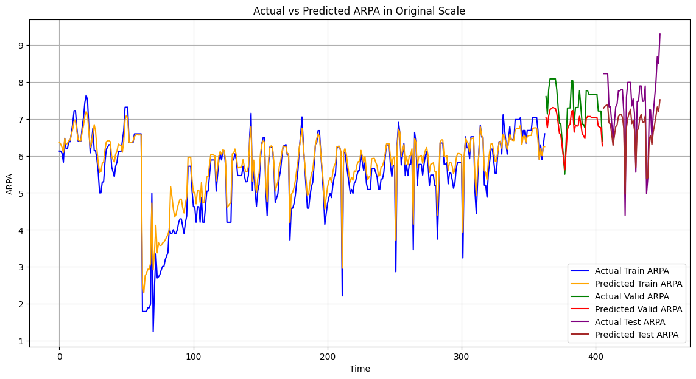

# 🐄 Livestock Feed Forecasting with LSTM

This project presents a deep learning-based multivariate time-series forecasting pipeline to predict livestock feed consumption using LSTM architecture. Developed at **Wellztech A.Ş.**, the model is designed to forecast variables such as **ARPA** and **YEM**, optimize training via **Bayesian tuning**, and visualize performance using **TensorBoard**.

---

## 📁 Repository Contents

- `LSTM Livestock Feed Forecasting/` – Notebooks and datasets  
- `assets/` – Visual outputs and figures  
- `LICENSE` – MIT License  
- `README.md` – You are here

---

## 📌 Features

- 📊 Multivariate input: `SAMAN`, `ARPA`, `SLAJ`, `YEM`, `SU`  
- 🧠 Target prediction: `ARPA`, `YEM`  
- 🪟 Sliding window time-series formatting  
- 🏗️ Model: LSTM + Dropout + L2 + BatchNormalization  
- 🔁 Optimizers: Adam (tuned), SGD (optional)  
- 📉 Loss: Huber Loss  
- 📈 Metric: RMSE  
- 🧪 Cross-validation with `TimeSeriesSplit`  
- 🎯 Hyperparameter search with `Keras Tuner` (Bayesian)  
- 📋 Visual diagnostics via `TensorBoard`  

---

## 🔍 Exploratory Analysis

### 🔸 Correlation Matrix of Feed Variables

<p align="center">
  
</p>

---

## 🏗️ Training Performance

### 🔹 Training & Validation Loss

The training process was monitored using early stopping and adaptive learning rate scheduling.

<p align="center">
  
</p>

---

## 🎯 Predictions

### 🔸 YEM Forecast (Train + Validation + Test)

<p align="center">
  
</p>

---

### 🔸 ARPA Forecast (Train + Validation + Test)

<p align="center">
  
</p>

---

## 🚀 How to Run

1. Clone the repository:
```bash
git clone https://github.com/yourusername/livestock-feed-forecasting.git
cd livestock-feed-forecasting
